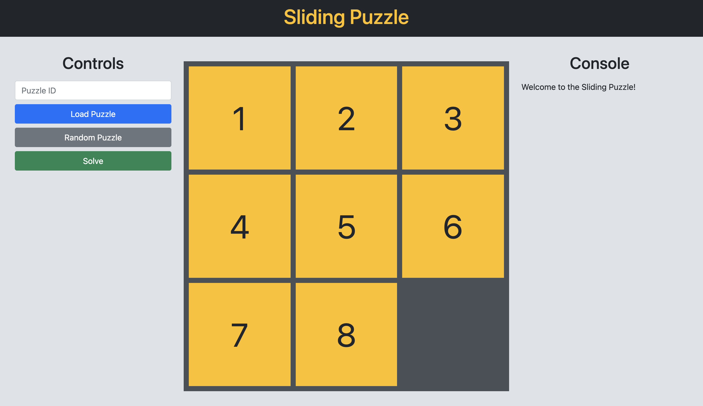

# Sliding Puzzle



This is a Ruby on Rails implementation of the Sliding Puzzle game, particularly the 8-puzzle. The goal is to slide around tiles and reach the target state which looks like this:

```
1  2  3
4  5  6
7  8
```

To run the server, type:

```
rails s
```

The bulk of the backend implementation is located under `app/solver`, including a custom D-ary Heap implementation and the actual algorithm being the A\* algorithm.

To create a "Puzzle ID," concatenate the puzzle using row-major order with 9 in place of the empty space. For example, this puzzle:

```
2  1  3
6  4  8
7  5
```

is represented by Puzzle ID `213648759`.
